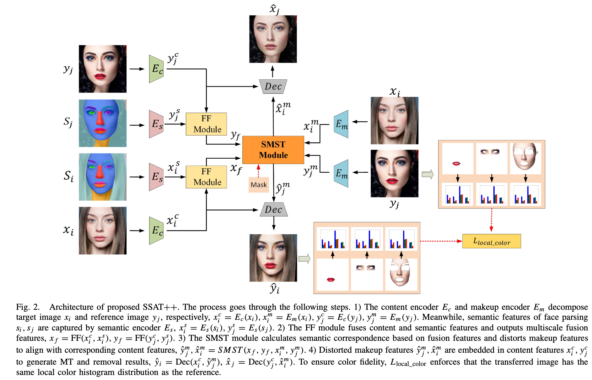
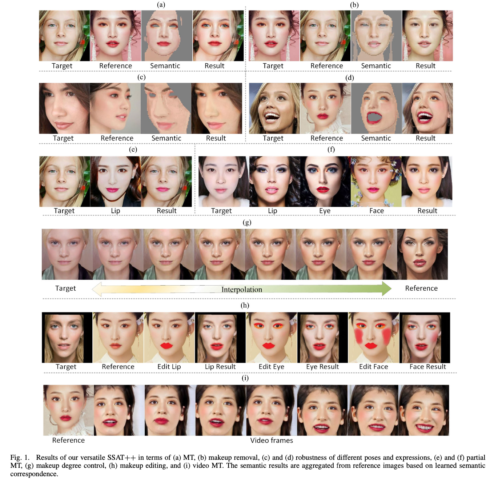

# SSAT++: A Semantic-Aware and Versatile Makeup Transfer Network With Local Color Consistency Constraint

This is the official pytorch code for **"SSAT++: A Semantic-Aware and Versatile Makeup Transfer Network With Local Color Consistency Constraint"**, which has been accepted by TNNLS2023.

**The training code, testing code, dataset, and pre-trained model have all been open sourced**
## Author
**Zhaoyang Sun; Yaxiong Chen; Shengwu Xiong**


## News

+ Our paper SHMT was accepted by NeurIPS2024. 

+ Our paper CSD-MT was accepted by CVPR2024. [Paper link](https://arxiv.org/abs/2405.17240) and [code link](https://github.com/Snowfallingplum/CSD-MT).

+ Our paper SSAT was accepted by AAAI2022. [Paper link](https://arxiv.org/abs/2112.03631) and [code link](https://github.com/Snowfallingplum/SSAT).

## The framework of SSAT++




## Requirements

We recommend that you just use your own pytorch environment; the environment needed to run our model is very simple. If you do so, please ignore the following environment creation.

A suitable [conda](https://conda.io/) environment named `SSAT` can be created
and activated with:

```
conda env create -f environment.yaml
conda activate SSAT
```

## Quick Start
1. Download the pre trained model and place it in the weights folder. [Baidu Drive](https://pan.baidu.com/s/1c1P8YIZPgv39jU4ufoIcsw), password: 7pim.
2. We have provided some examples, just run *inferrence.py* directly. ``` python inference.py```

## How to test a custom dataset

1. Prepare face parsing. Face parsing is used in this code. In our experiment, face parsing is generated by https://github.com/zllrunning/face-parsing.PyTorch.
2. Put the results of face parsing in the .\examples\seg1\makeup and \examples\seg1\non-makeup
3. python inference.py.  

## Download our dataset
Our dataset can be downloaded here [Baidu Drive](https://pan.baidu.com/s/1ozcLdlsykv3tb32X2bfP3w), password: cdrb.

Extract the downloaded file and place it on top of this folder.

## Training code
We have set the default hyperparameters in the options.py file, please modify them yourself if necessary.
To train the model, please run the following command directly
```
python train.py
```

## Inference code

```
python inference.py
```

## Our results



## Citation

If this work is helpful for your research, please consider citing the following BibTeX entry.

```text
@article{sun2024ssat++,
  title={SSAT++: A Semantic-Aware and Versatile Makeup Transfer Network With Local Color Consistency Constraint},
  author={Sun, Zhaoyang and Chen, Yaxiong and Xiong, Shengwu},
  journal={IEEE Transactions on Neural Networks and Learning Systems},
  year={2023},
  publisher={IEEE}
}
```


## Acknowledgement

Some of the codes are build upon [PSGAN](https://github.com/wtjiang98/PSGAN), [Face Parsing](https://github.com/zllrunning/face-parsing.PyTorch) and [aster.Pytorch](https://github.com/ayumiymk/aster.pytorch).

## License

This work is licensed under a
[Creative Commons Attribution-NonCommercial-ShareAlike 4.0 International License][cc-by-nc-sa].

[![CC BY-NC-SA 4.0][cc-by-nc-sa-image]][cc-by-nc-sa]

[cc-by-nc-sa]: http://creativecommons.org/licenses/by-nc-sa/4.0/
[cc-by-nc-sa-image]: https://licensebuttons.net/l/by-nc-sa/4.0/88x31.png
[cc-by-nc-sa-shield]: https://img.shields.io/badge/License-CC%20BY--NC--SA%204.0-lightgrey.svg

